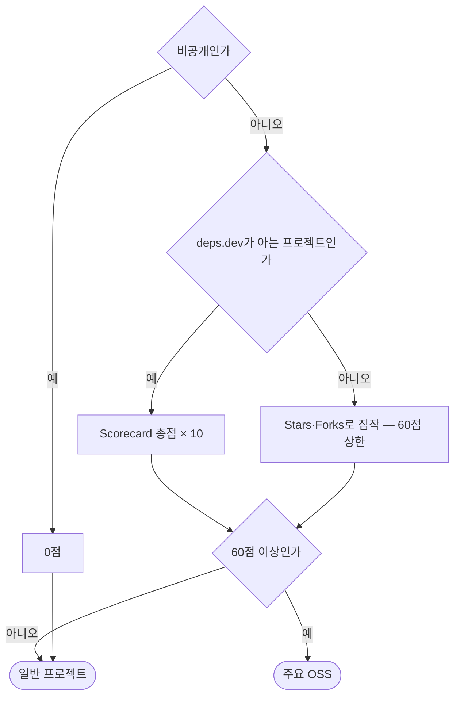
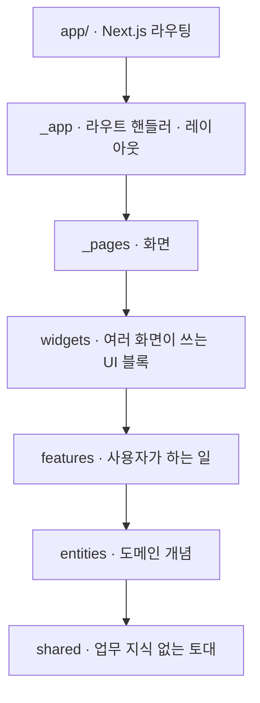

# Patchwork


내 repository가 아닌 곳에 얼마나 기여했는지 보여주는 GitHub contribution fetcher.

흩어진 commit, pull request, review, issue를 한 화면에 이어 붙이고 진행 중인 PR이 어디서 막혀 있는지 보여줍니다. merge된 기여만 골라 README에 붙일 Markdown으로 뽑을 수도 있습니다.

## 주요 OSS만 골라 보기

기여 건수만 세면 star 3개짜리 토이 프로젝트 commit과 널리 쓰이는 프로젝트의 patch가 같은 무게로 잡힙니다. 그래서 repository마다 0~100점을 매기고 **60점 이상만 주요 OSS로 봅니다.**

점수는 [OpenSSF Scorecard](https://github.com/ossf/scorecard)를 [deps.dev](https://deps.dev)에서 받아 그대로 씁니다. 코드 리뷰 요구, 의존성 고정, CI 권한, SAST 등 14개 항목을 외부에서 같은 기준으로 채점한 값입니다.



실제 점수를 보면 기준선이 어디쯤인지 감이 옵니다.

| repository | Scorecard | 점수 |
| --- | --- | --- |
| expressjs/express | 8.5 | 85 |
| microsoft/TypeScript | 8.0 | 80 |
| facebook/react | 7.0 | 70 |
| vercel/next.js | 6.2 | 62 |
| chalk/chalk | 4.6 | 46 |
| octocat/Hello-World | 1.9 | 19 |

Scorecard는 **관리 품질**을 재고 인기를 재지 않습니다. 널리 쓰이지만 CI가 느슨한 프로젝트는 낮게 나옵니다. deps.dev가 모르는 repository만 Stars·Forks로 짐작하고, 검증되지 않은 만큼 경계선에 겨우 닿게 둡니다.

대시보드는 기본으로 주요 OSS만 보여주고, `전체` 탭을 누르면 일반 프로젝트까지 나옵니다. 경계는 [impact.ts](src/entities/repo/model/impact.ts)에서 바꿉니다.

## 시작하기

```bash
cp .env.example .env.local   # GitHub OAuth 앱 값을 채웁니다
npm install
npm run dev
```

`SESSION_SECRET`은 `openssl rand -hex 32`로 만듭니다. OAuth 앱이 없으면 홈 화면이 만드는 방법을 알려줍니다. deps.dev는 인증이 필요 없어 따로 설정할 것이 없습니다.

## 구조

[Feature-Sliced Design](https://feature-sliced.design)을 Next.js App Router에 적용했습니다. 라우팅은 루트 `app/`에 재내보내기 한 줄씩만 두고, 실제 코드는 `src/`에 있습니다.



화살표는 "가져다 쓴다"는 뜻입니다. 위에서 아래로만 흐르고, 아래 어느 레이어든 건너뛰어 쓸 수 있습니다. 레이어 규칙과 예외는 [AGENTS.md](AGENTS.md)에 있습니다.

## 검사

```bash
npm run test:all      # 아래 전부
npm run typecheck     # tsc
npm run lint          # eslint
npm run lint:arch     # steiger · FSD 레이어·공개 API 위반
npm run test:coverage # vitest · 4개 지표 100% 미만이면 실패
npm run test:e2e      # playwright
```

E2E는 GitHub과 deps.dev 대역 서버를 띄우고 앱을 그쪽으로 물려 실제 OAuth 흐름까지 지나갑니다. 개발 서버와 산출물이 섞이지 않도록 `.next-e2e`에 따로 빌드합니다.
