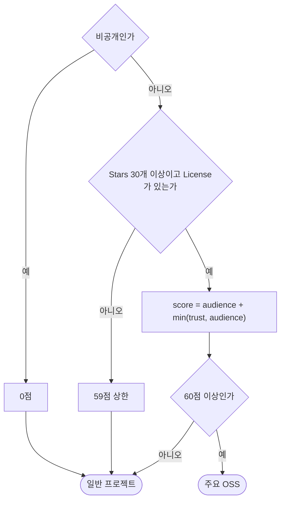
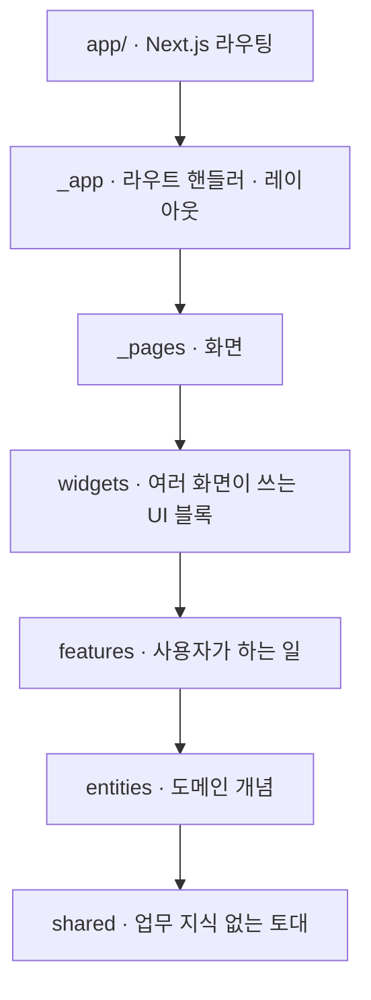

# Patchwork


내 repository가 아닌 곳에 얼마나 기여했는지 보여주는 GitHub contribution fetcher.

흩어진 commit, pull request, review, issue를 한 화면에 이어 붙이고 진행 중인 PR이 어디서 막혀 있는지 보여줍니다. merge된 기여만 골라 README에 붙일 Markdown으로 뽑을 수도 있습니다.

## 주요 OSS만 골라 보기

기여 건수만 세면 star 3개짜리 토이 프로젝트 commit과 널리 쓰이는 프로젝트의 patch가 같은 무게로 잡힙니다. 그래서 repository마다 0~100점을 매기고 **60점 이상만 주요 OSS로 봅니다.** 실질 기준선은 Stars 600개 안팎입니다.



| 덩어리 | 신호 | 배점 |
| --- | --- | --- |
| **audience** — 바깥에서 쓰거나 참여한 흔적 | Stars (로그 스케일) | 45 |
| | Forks (로그 스케일) | 15 |
| **trust** — 잘 관리되고 있다는 신호 | Organization 소유 | 14 |
| | 업력 2년 이상 | 10 |
| | 최근 push (90일 내 16 / 1년 내 8) | 16 |
| 감점 | Fork / Archived | −25 / −20 |

`trust`는 `audience`를 넘겨 받지 못합니다. 외부 관심이 0이면 아무리 잘 관리해도 0점입니다. 이렇게 묶지 않으면 아무도 쓰지 않는 사내 프로젝트가 "org 소유 + 최근 push"만으로 올라옵니다.

대시보드는 기본으로 주요 OSS만 보여주고, `전체` 탭을 누르면 일반 프로젝트까지 나옵니다. 가중치와 경계는 [impact.ts](src/entities/repo/model/impact.ts)에서 바꿉니다.

## 시작하기

```bash
cp .env.example .env.local   # GitHub OAuth 앱 값을 채웁니다
npm install
npm run dev
```

`SESSION_SECRET`은 `openssl rand -hex 32`로 만듭니다. OAuth 앱이 없으면 홈 화면이 만드는 방법을 알려줍니다.

## 구조

[Feature-Sliced Design](https://feature-sliced.design)을 Next.js App Router에 적용했습니다. 라우팅은 루트 `app/`에 재내보내기 한 줄씩만 두고, 실제 코드는 `src/`에 있습니다.



화살표는 "가져다 쓴다"는 뜻입니다. 위에서 아래로만 흐르고, 아래 어느 레이어든 건너뛰어 쓸 수 있습니다. 레이어 규칙과 예외는 [AGENTS.md](AGENTS.md)에 있습니다.

## 검사

```bash
npm run test:all      # 아래 전부
npm run typecheck     # tsc
npm run lint          # eslint
npm run lint:arch     # steiger · FSD 레이어·공개 API 위반
npm run test:coverage # vitest · 4개 지표 100% 미만이면 실패
npm run test:e2e      # playwright
```

E2E는 GitHub 대역 서버를 띄우고 앱을 그쪽으로 물려 실제 OAuth 흐름까지 지나갑니다. 개발 서버와 산출물이 섞이지 않도록 `.next-e2e`에 따로 빌드합니다.
